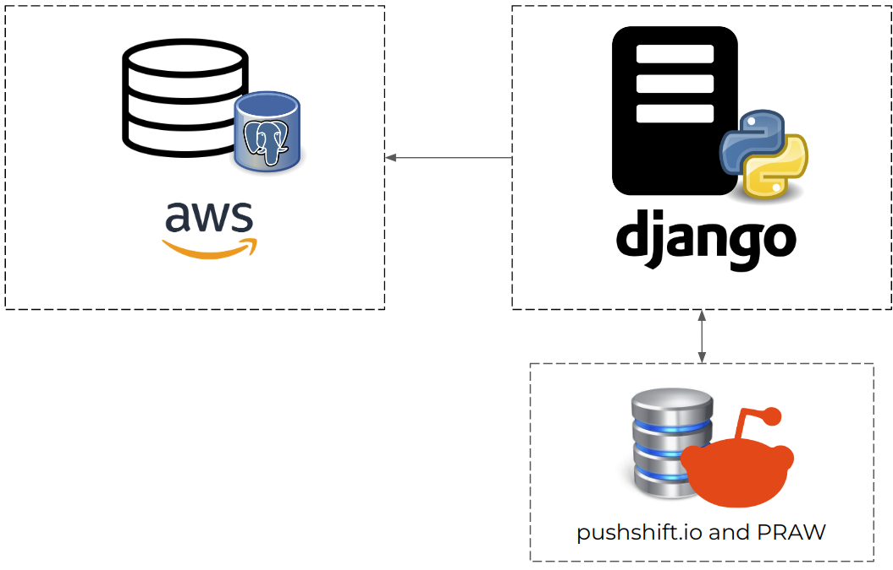

# Reddit in portuguese (ETL)
Backend server to extract, load and transform data of subreddits from Brazil and Portugal

Backend server to extract, load and transform data from Brazilian and Portuguese subreddits.

This project is developed in Django and its objective is to extract historical data from subreddits whose main language is Portuguese, and store this data in a Postgresql database hosted on Heroku.



Extracts were performed using the PRAW library, the Reddit API and the Pushshift API to capture historical data.

The generated dataset was summarized in a CSV file available on Kaggle and Hugging Face.

Some access keys were used, if you want to adapt this repository to another project, you will need to create an .env file with information about access keys, databases and django-specific information.

```
.env

# Reddit auth
REDDITUSER=''
REDDITKEY=''
REDDITID=''

# Django
SECRET_KEY=''
DEBUG=

# Database
DB_NAME=''
DB_USER=''
DB_PASSWORD=''
DB_HOST=''
DB_PORT=''
```